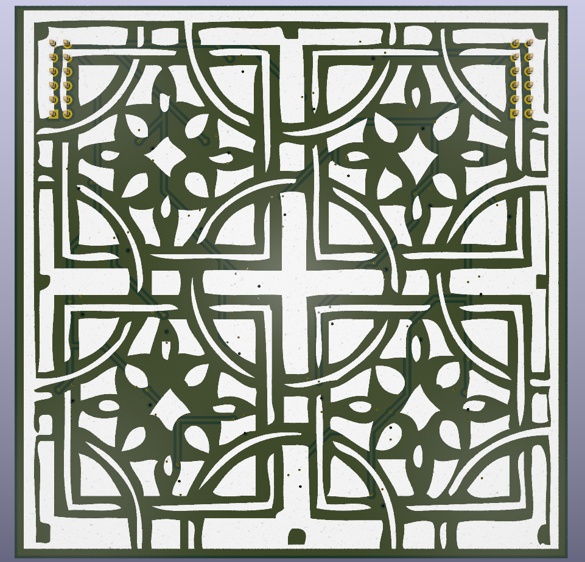
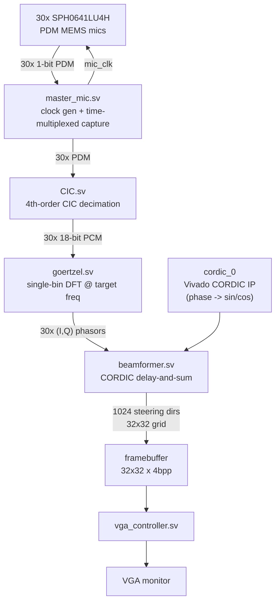
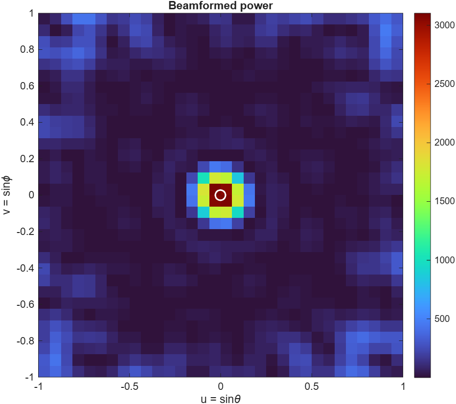
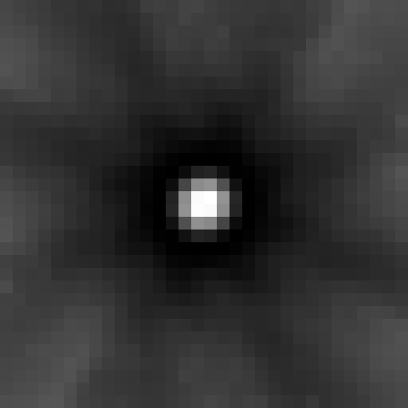
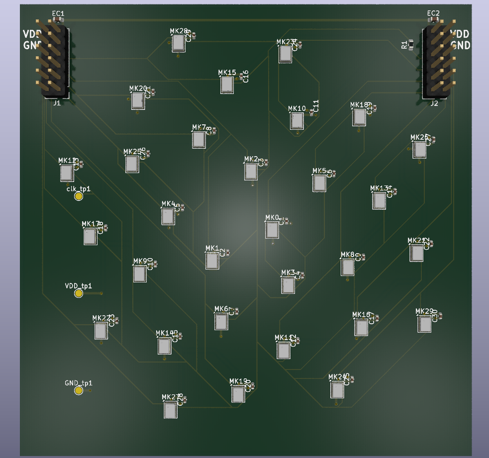

# Acoustic Camera

A real-time acoustic camera built around a 30-element MEMS microphone array and an FPGA beamformer. The FPGA extracts a single target frequency from every microphone, steers a 32×32 grid of look directions with a CORDIC-based phase rotator, and paints the resulting sound-power map straight out over VGA.

## How it works

1. **Acquisition** (`master_mic.sv`) — the 30 microphones are wired as 15 pairs sharing 15 physical pins; even mics are latched on one clock phase, odd mics on the other, so all 30 PDM streams are captured with one `mic_clk`.
2. **Decimation** (`CIC.sv`) — each mic's 1-bit PDM stream is decimated by a 4th-order CIC filter into signed 18-bit PCM audio.
3. **Frequency extraction** (`goertzel.sv`) — a single-bin Goertzel filter (default target: 20 kHz) runs per microphone, producing the real/imaginary component of that mic's signal at the target frequency.
4. **Beamforming** (`beamformer.sv`) — for each of 1024 steering directions (a 32×32 `(u,v)` grid), a Xilinx CORDIC IP core (`cordic_0`) rotates every microphone's phasor by the phase delay for that direction; the rotated phasors are summed and the power is written into the corresponding framebuffer pixel.
5. **Display** (`vga_controller.sv`) — the 32×32, 4-bit-per-pixel framebuffer is scanned out over standard VGA timing to a monitor.

Mic positions follow a Fermat/Vogel spiral ("sunflower" pattern) so steering delays are computed from fixed-point `(X, Y)` coordinates baked into `beamformer.sv` at synthesis time.

## Repository layout

| Path | Contents |
|---|---|
| `FPGA/` | Vivado 2025.2 project targeting a Digilent Basys3 (`xc7a35tcpg236-1`). SystemVerilog sources live in `acoustic_camera.srcs/sources_1/new/`, testbenches in `acoustic_camera.srcs/sim_1/new/`. |
| `PCB/` | KiCad project for the 30-mic sensor board (SPH0641LU4H PDM MEMS microphones). |
| `MATLAB/` | Floating-point beamforming simulation and mic-array coordinate generation used to derive the fixed-point constants in `beamformer.sv`. |
| `pics/` | PCB photos and simulated/measured beamformer output images. |

## FPGA modules

| Module | Role |
|---|---|
| `acoustic_camera.sv` | Top level; wires the mic front end, Goertzel bank, beamformer, and VGA controller together. |
| `master_mic.sv` | Mic clock generation and time-multiplexed capture of the 30 PDM lines. |
| `CIC.sv` | 4th-order CIC decimation filter, PDM → 18-bit PCM. |
| `goertzel.sv` | Per-mic single-bin DFT at the configured target frequency. |
| `beamformer.sv` | CORDIC-driven phase-domain delay-and-sum beamformer, 32×32 steering grid. |
| `vga_controller.sv` | Scans the framebuffer out over VGA. |
| `cordic_0` | Vivado-generated CORDIC IP (phase → sin/cos), used by the beamformer. |

## Simulation

- `master_mic_tb.sv`, `beamformer_tb.sv` — unit testbenches for the mic front end and beamformer.
- `acoustic_camera_tb.sv` — drives a synthetic tone into the full pipeline and dumps the resulting framebuffer to `framebuffer.txt`.
- `FPGA/script.py` converts `framebuffer.txt` into a viewable PNG (`beamform.png`) for quick visual inspection of simulation results.

## MATLAB

- `coordinates.m` — generates the Fermat-spiral microphone positions and the fixed-point `(X, Y)` constants consumed by `beamformer.sv`.
- `acoustic_camera.m` — floating-point simulation of the beamforming algorithm, used to validate steering vectors and visualize expected sound-source power maps before committing a design to hardware.

## Beamforming results

| Single source | Double source |
|---|---|
|  |  |

*32×32 Vivado simulation output at a 20 kHz target frequency, upscaled to 512×512 (nearest-neighbor) for legibility.*

## Hardware

- 30x Knowles/CUI `SPH0641LU4H` PDM MEMS microphones on a Fermat-spiral array, laid out and placed programmatically via `PCB/script.py` (KiCad scripting console).
- Sensor board connects to the Basys3 over the JA and JXADC Pmod headers (see `FPGA/acoustic_camera.srcs/constrs_1/new/acoustic_camera.xdc`).
- VGA output drives a standard monitor for the live 32×32 heat-map display.

## Getting started

- **FPGA**: open `FPGA/acoustic_camera.xpr` in Vivado 2025.2 or later (Basys3 board files required); the CORDIC IP core is regenerated automatically from `cordic_0.xci`.
- **PCB**: open `PCB/acoustic_camera.kicad_pro` in KiCad 7+.
- **MATLAB**: run `MATLAB/acoustic_camera.m` for the beamforming simulation, or `MATLAB/coordinates.m` to regenerate the mic array layout constants.

## Status

Work in progress. The mic front end, Goertzel bank, CORDIC beamformer, and VGA output are implemented and verified in simulation, and the PCB has been through several fabrication/assembly iterations. Full end-to-end bring-up on hardware (populated array → FPGA → live VGA image) is ongoing.

## License

MIT — see [LICENSE](LICENSE).
