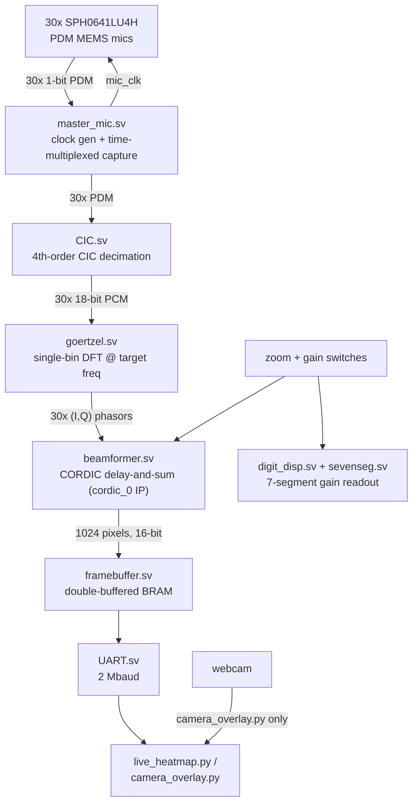
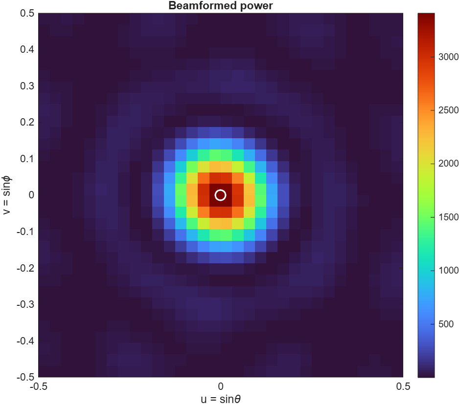
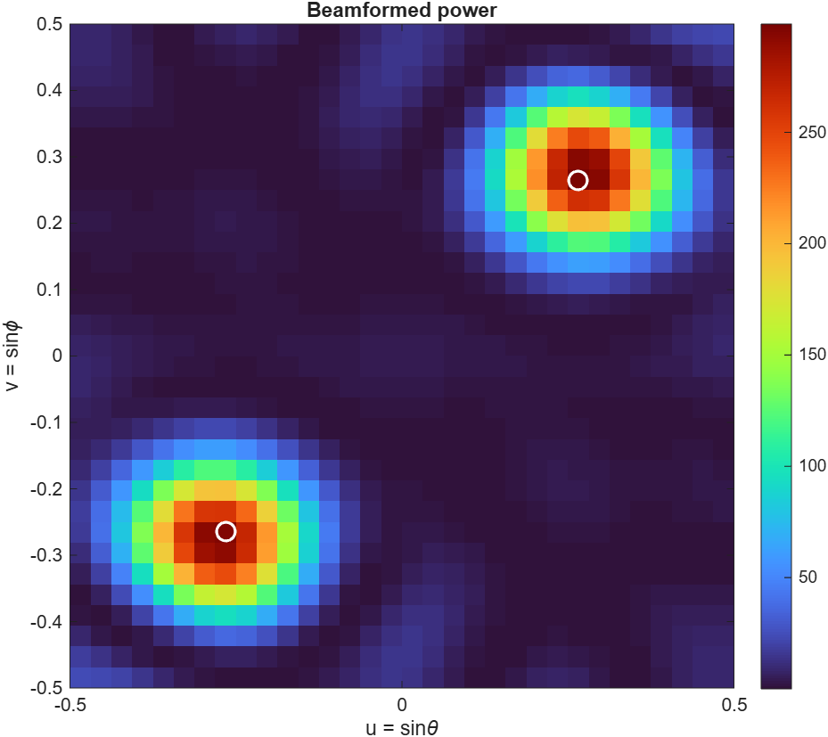
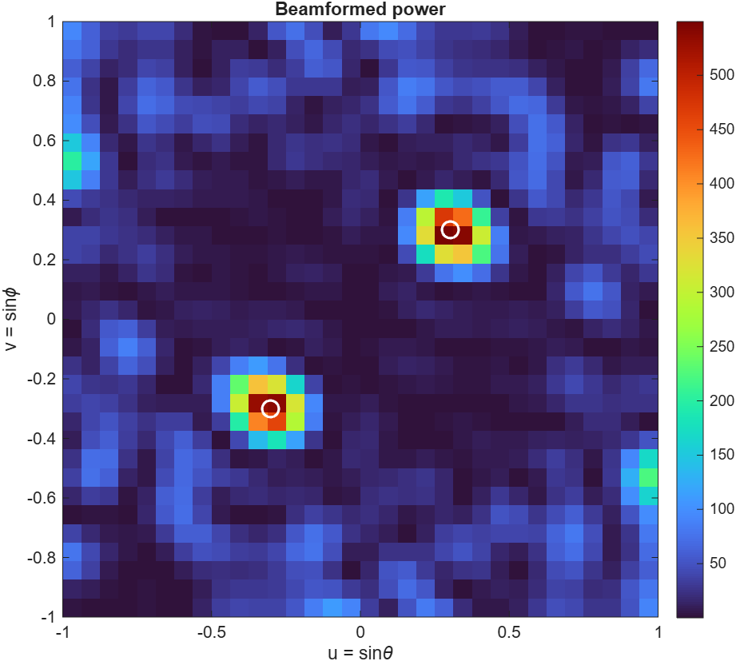
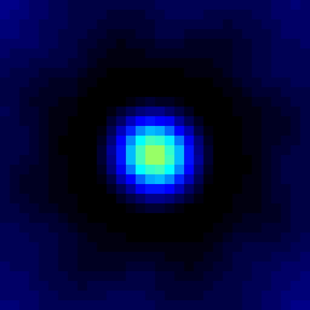
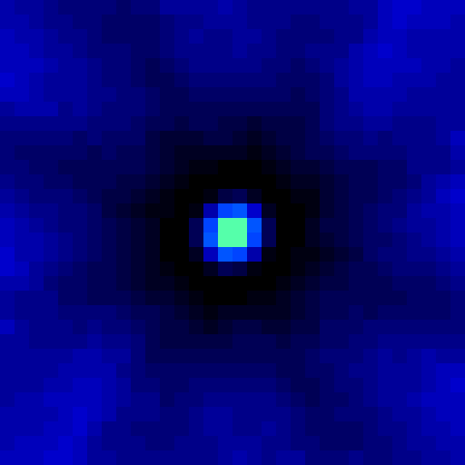
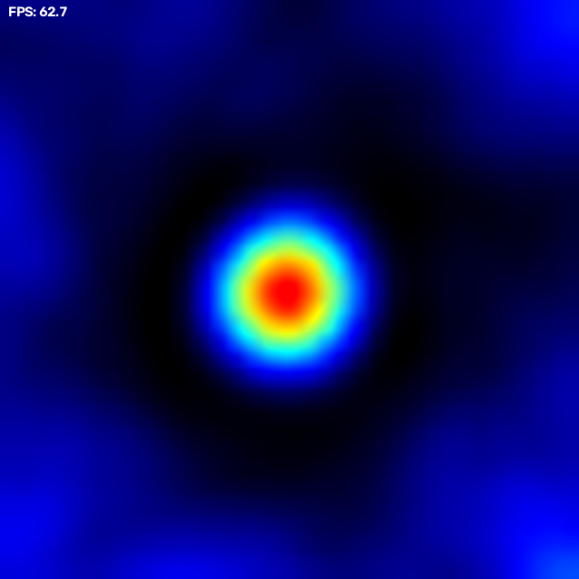
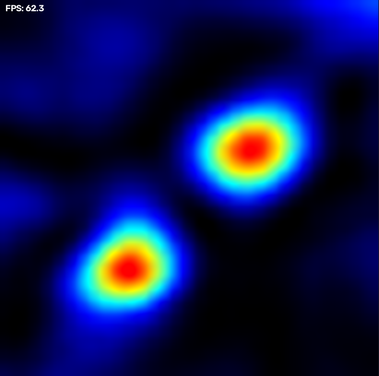
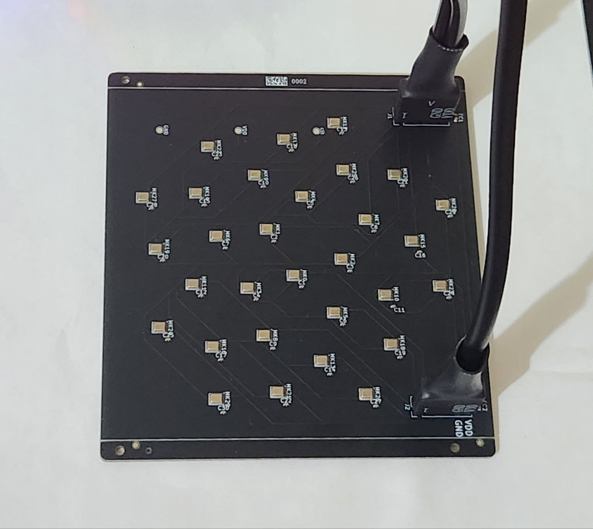
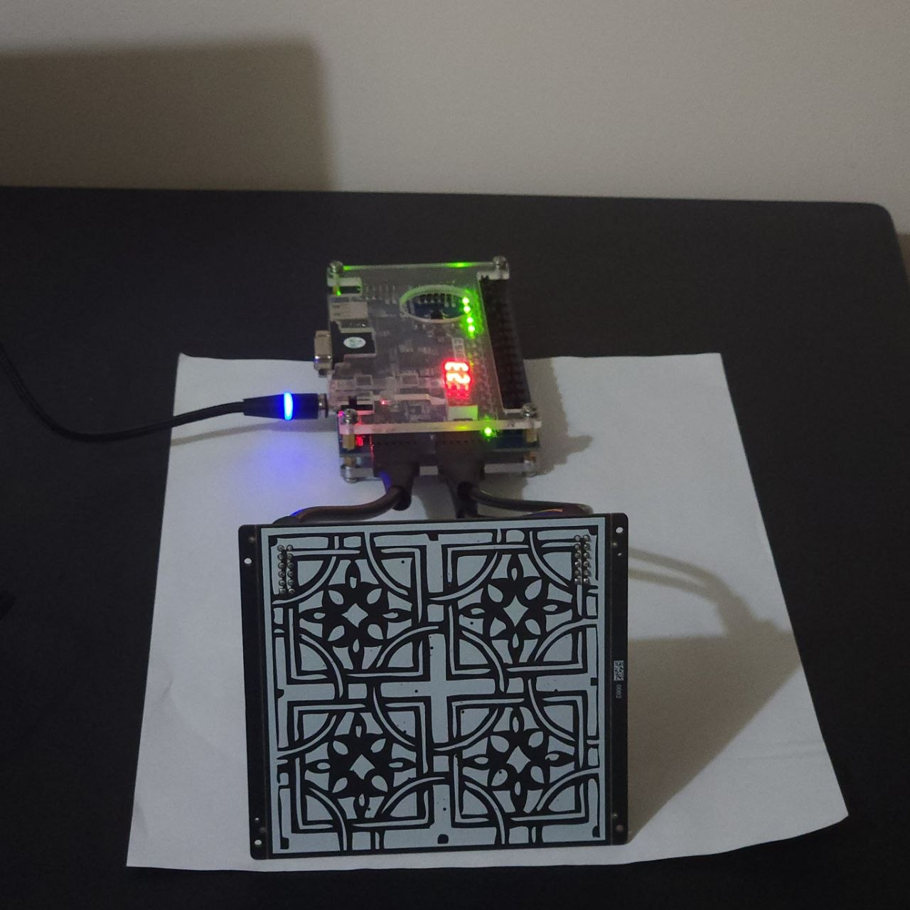

# Acoustic Camera

A real-time acoustic camera built around a 30-element MEMS microphone array and an FPGA beamformer. The FPGA extracts a single target frequency from every microphone, steers a 32×32 grid of look directions with a CORDIC-based phase rotator, and streams the resulting sound-power map out over UART to a Python viewer — either a plain live heatmap, or overlaid on a webcam feed. A physical switch flips the beamformer between a wide 180° field of view and a zoomed-in 60° view, another five switches set display gain (read back on the board's own 7-segment display), and holding spacebar in the camera overlay re-centers the heatmap on whatever's currently loudest.

[▶ Watch the demo](pics/demo.mp4)

## How it works



1. **Acquisition** (`master_mic.sv`) — the 30 microphones are wired as 15 pairs sharing 15 physical pins; even mics are latched on one clock phase, odd mics on the other, so all 30 PDM streams are captured with one `mic_clk`.
2. **Decimation** (`CIC.sv`) — each mic's 1-bit PDM stream is decimated by a 4th-order CIC filter into signed 18-bit PCM audio.
3. **Frequency extraction** (`goertzel.sv`) — a single-bin Goertzel filter (default target: 20 kHz) runs per microphone, producing the real/imaginary component of that mic's signal at the target frequency.
4. **Beamforming** (`beamformer.sv`) — for each of 1024 steering directions (a 32×32 `(u,v)` grid), a Xilinx CORDIC IP core (`cordic_0`) rotates every microphone's phasor by the phase delay for that direction; the rotated phasors are summed and the power is written into the corresponding pixel of a double-buffered block-RAM framebuffer. The **zoom switch** rescales the mic coordinates fed into this calculation, narrowing the steering grid from a 180° field of view down to 60°. The **gain switches** set how far the accumulated power is right-shifted before being stored, controlling display brightness.
5. **Readout** (`UART.sv`) — once a full 1024-pixel frame is ready, it's streamed out at 2 Mbaud (`0xAA 0x55` sync header, then each pixel as 16-bit little-endian) to a host PC.
6. **On-board readout** (`digit_disp.sv` / `sevenseg.sv`) — the current gain value is continuously multiplexed onto the board's two-digit 7-segment display, so gain can be read without a host PC attached.

A `vga_controller.sv` module also exists (reads the same framebuffer and drives standard VGA timing) but isn't currently wired into the top level, since the framebuffer only exposes a single read port and UART already owns it.

Mic positions follow a Fermat/Vogel spiral ("sunflower" pattern) so steering delays are computed from fixed-point `(X, Y)` coordinates baked into `beamformer.sv` at synthesis time.

## Live viewer (Python)

Both tools auto-detect the Basys3's UART over USB (FTDI VID:PID `0403:6010`) — no port needs to be specified.

- **`live_heatmap.py`** — a plain live heatmap window. Run it with no arguments.
- **`camera_overlay.py`** — alpha-blends the heatmap over a webcam feed (window 0) instead, with the black→blue→cyan→yellow→red gradient faded in proportionally to signal strength, so quiet regions stay transparent and only real sources light up. A one-pole temporal filter (`PERSISTENCE_DECAY`) smooths frame-to-frame noise. **Hold spacebar** to re-center the heatmap on whatever's currently loudest, correcting for the mic array not being perfectly boresighted with the camera.

```
pip install pyserial opencv-python numpy
python3 live_heatmap.py
python3 camera_overlay.py
```

## Repository layout

| Path | Contents |
|---|---|
| `FPGA/` | Vivado 2025.2 project targeting a Digilent Basys3 (`xc7a35tcpg236-1`). SystemVerilog sources live in `acoustic_camera.srcs/sources_1/new/`, testbenches in `acoustic_camera.srcs/sim_1/new/`. |
| `PCB/` | KiCad project for the 30-mic sensor board (SPH0641LU4H PDM MEMS microphones). |
| `MATLAB/` | Floating-point beamforming simulation and mic-array coordinate generation used to derive the fixed-point constants in `beamformer.sv`. |
| `pics/` | PCB photos/renders and simulated/measured beamformer output, at both FOV settings. |
| `live_heatmap.py`, `camera_overlay.py` | Live viewers for the UART pixel stream (see above). |

## FPGA modules

| Module | Role |
|---|---|
| `acoustic_camera.sv` | Top level; wires the mic front end, Goertzel bank, beamformer, framebuffer, UART, and 7-segment display together. |
| `master_mic.sv` | Mic clock generation and time-multiplexed capture of the 30 PDM lines. |
| `CIC.sv` | 4th-order CIC decimation filter, PDM → 18-bit PCM. |
| `goertzel.sv` | Per-mic single-bin DFT at the configured target frequency. |
| `beamformer.sv` | CORDIC-driven phase-domain delay-and-sum beamformer, 32×32 steering grid, switchable 60°/180° FOV and gain. |
| `framebuffer.sv` | Double-buffered (ping-pong) block-RAM frame store; the beamformer writes one buffer while UART reads out the other. |
| `UART.sv` | Streams a completed frame out at 2 Mbaud once `frame_ready` pulses. |
| `digit_disp.sv` / `sevenseg.sv` | Multiplexes the current gain value onto the board's 7-segment display. |
| `vga_controller.sv` | Reads the framebuffer and drives standard VGA timing; present but not currently instantiated (see above). |
| `cordic_0` | Vivado-generated CORDIC IP (phase → sin/cos), used by the beamformer. |

## On-board controls

| Control | Effect |
|---|---|
| `gain[4:0]` (5 switches) | Sets the right-shift applied to each pixel's accumulated power before storage — controls display brightness/sensitivity. Mirrored on the 7-segment display. |
| `zoom` (switch) | 1 = 60° field of view (zoomed in), 0 = 180° field of view (wide). |
| `rst` (button) | Active-low system reset. |

## Simulation

- `master_mic_tb.sv`, `beamformer_tb.sv` — unit testbenches for the mic front end and beamformer.
- `acoustic_camera_tb.sv` — drives a synthetic tone into the full pipeline and dumps the resulting frame to `framebuffer.txt`.
- `FPGA/sim_image.py` converts `framebuffer.txt` into a viewable PNG for quick visual inspection of simulation results.

## MATLAB

- `coordinates.m` — generates the Fermat-spiral microphone positions and the fixed-point `(X, Y)` constants consumed by `beamformer.sv`.
- `acoustic_camera.m` — floating-point simulation of the beamforming algorithm, used to validate steering vectors and visualize expected sound-source power maps (at both 60° and 180° FOV) before committing a design to hardware.

## Results

Three stages of validation, from the floating-point reference model down to the physical board:

**1. MATLAB (floating-point algorithm)**

| | 60° FOV | 180° FOV |
|---|---|---|
| Single source |  |  |
| Double source |  |  |

**2. Vivado (RTL simulation)** — confirms the fixed-point SystemVerilog implementation matches the floating-point reference above:

| 60° FOV | 180° FOV |
|---|---|
|  |  |

**3. Hardware (live capture)** — via `camera_overlay.py`, at 60° FOV:

| Single source | Double source |
|---|---|
|  |  |

## Hardware

| | |
|---|---|
|  |  |
|  |  |

- 30x Knowles/CUI `SPH0641LU4H` PDM MEMS microphones on a Fermat-spiral array, laid out and placed programmatically via `PCB/script.py` (KiCad scripting console).
- Sensor board connects to the Basys3 over the JA and JXADC Pmod headers (see `FPGA/acoustic_camera.srcs/constrs_1/new/acoustic_camera.xdc`).
- Output is a plain UART TX line, read by a host PC's USB-serial adapter — no VGA monitor needed for normal operation.

## Getting started

- **FPGA**: open `FPGA/acoustic_camera.xpr` in Vivado 2025.2 or later (Basys3 board files required); the CORDIC IP core is regenerated automatically from `cordic_0.xci`.
- **Live viewer**: `pip install pyserial opencv-python numpy`, then run `python3 live_heatmap.py` or `python3 camera_overlay.py` (no arguments needed — both auto-detect the board over USB).
- **PCB**: open `PCB/acoustic_camera.kicad_pro` in KiCad 7+.
- **MATLAB**: run `MATLAB/acoustic_camera.m` for the beamforming simulation, or `MATLAB/coordinates.m` to regenerate the mic array layout constants.

## Status

End-to-end bring-up on hardware works: populated array → FPGA → UART → live heatmap on a host PC, with switchable FOV/gain and an optional webcam overlay. Remaining work is refinement (calibration, image quality) rather than core functionality.

## License

MIT — see [LICENSE](LICENSE).
